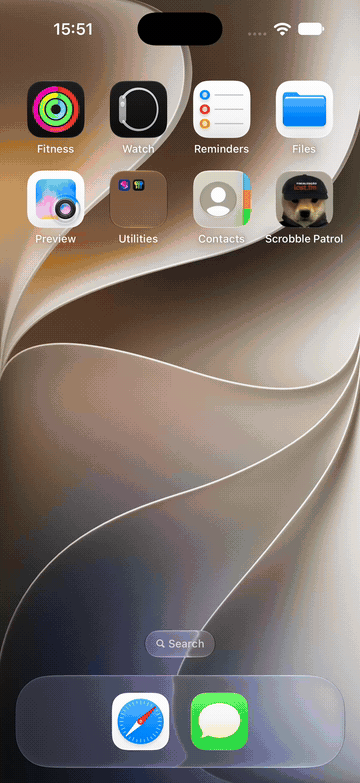

# Scrobble Patrol

*Desafio técnico · 25–28 de setembro de 2026*

App iOS para explorar o histórico musical de um usuário do Last.fm. Mostra os scrobbles recentes, os detalhes de um álbum e uma grade compartilhável com os álbuns mais ouvidos.

## Demonstração



O app tem duas abas: **Recentes** e **Semaninha**. O detalhe de um álbum abre ao selecionar um item da lista ou da grade.

## Funcionalidades

- **Recentes:** busca scrobbles pelo username do Last.fm, salva o username localmente, carrega páginas adicionais ao chegar ao fim da lista e permite atualizar com pull-to-refresh. Identifica a faixa tocando agora quando essa informação está disponível.
- **Detalhe do álbum:** apresenta capa, artista, tags, estatísticas e faixas fornecidas pelo Last.fm, além de um botão para abrir o álbum no serviço.
- **Semaninha:** gera uma grade de álbuns mais ouvidos para semana, mês ou ano, nos formatos 3×3, 4×4 ou 5×5. A grade pode ser compartilhada como imagem pelo menu do iOS.

Alterar o username ou os controles da grade não inicia uma consulta automaticamente. Na aba Recentes, confirme o username em **OK**; na Semaninha, toque em **Gerar**.

## Endpoints do Last.fm

- [`user.getRecentTracks`](https://www.last.fm/api/show/user.getRecentTracks): consulta os scrobbles recentes e suas páginas.
- [`album.getInfo`](https://www.last.fm/api/show/album.getInfo): busca os dados exibidos no detalhe do álbum.
- [`user.getTopAlbums`](https://www.last.fm/api/show/user.getTopAlbums): busca os álbuns mais ouvidos para o período e o tamanho da grade selecionados.

## Como executar

**Requisitos:** Xcode 27, um simulador iOS compatível com o deployment target do projeto (iOS 26.6 ou superior) e uma chave de API do Last.fm. O Xcode resolve a dependência SnapKit pelo Swift Package Manager.

1. Copie `ScrobblePatrol/Configuration/Secrets.example.xcconfig` para `ScrobblePatrol/Configuration/Secrets.xcconfig`.
2. Preencha o arquivo criado:

   ```xcconfig
   LASTFM_API_KEY = sua_chave_aqui
   ```

3. Abra `ScrobblePatrol/ScrobblePatrol.xcodeproj` no Xcode, selecione um simulador compatível e execute o target **ScrobblePatrol**.

`Secrets.xcconfig` é ignorado pelo Git. A chave é incorporada ao app durante o build, então essa configuração evita publicá-la no repositório, mas não a torna secreta no aplicativo distribuído.

## Organização do código

As telas usam **UIKit com View Code e SnapKit**. Cada funcionalidade segue o fluxo VIP: a `ViewController` recebe interações, o `Interactor` controla a operação, e o `Presenter` prepara as respostas para a tela. `Router` cuida da navegação para o detalhe; as `Factories` montam as dependências.

O `LastFmRepository` converte as respostas da API em modelos do app. O `LastFmAPIClient` constrói as requisições com `URLComponents` e trata erros de rede, HTTP, decodificação e da API. `UsernameStore` persiste o username em `UserDefaults`, enquanto `ImageLoader` usa `NSCache` para as capas.

```text
ScrobblePatrol/ScrobblePatrol/
├── App/                  Inicialização e composição das telas
├── Common/Networking/    Cliente HTTP e endpoints Last.fm
├── Common/Data/          DTOs, modelos e repository
├── Common/Images/        Carregamento e cache de imagens
├── Common/Storage/       Persistência do username
└── Features/             RecentScrobbles, AlbumDetail e AlbumGrid
```
